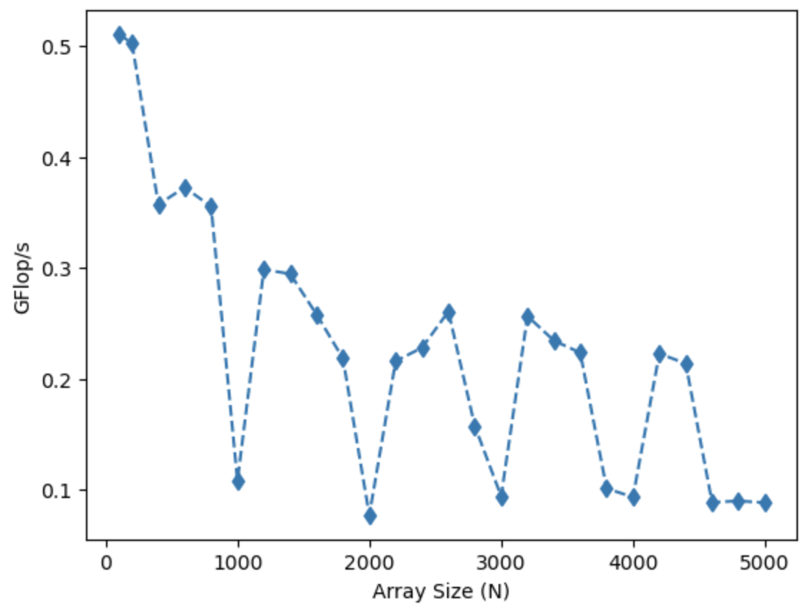
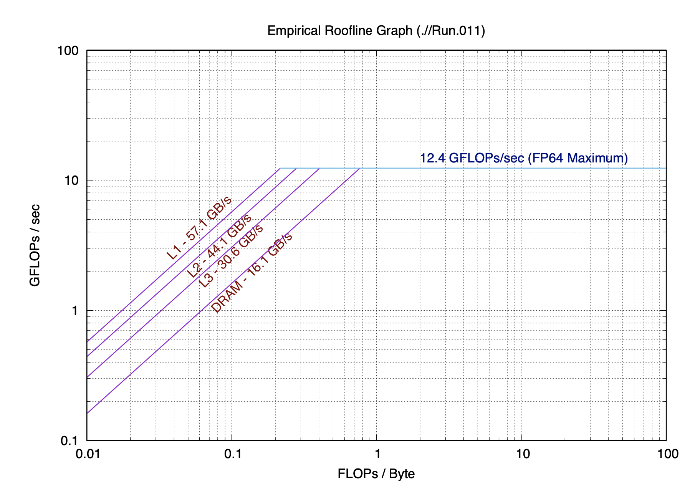

# Chris Gerlach and Daniel Nicklowitz - Project 1 Report 

## Warm-up

```C
  Y[j] += Y[j] + A[j][i] * B[i]
```

```C
  s += A[i] * A[i]
```

```C
  s += A[i] * B[i]
```

```C
  Y[i] = A[i] + C*B[i]
```

Included a table in your project report listing the arithmetic intensities for these kernels:

| Kernel # | Arithmetic Intensity | 
| -------- | -------- | 
|  1   | 0.0938  | 
|  2   | 0.25  |
|  3   | 0.125   |
|  4   | 0.0833  |


### Answer for arithmetic intensities:

* First kernel:
  1. Three flops including two summations and one multiplication.
  2. Three reads including `A[j][i]`, `B[i]`, and `Y[j]`, and one write `Y[j]`
  3. Arithmetic Intensity = $\frac{3}{4 \times 8}$
* Second kernel:
  1. Two flops including one summation and one multiplication.
  2. One read which includes `A[i]`
  3. `s` is a constant and stays in register. Therefore its read and write assumes to happen instantly.
  4. Arithmetic Intensity = $\frac{2}{1 \times 8}$
* Third kernel:
  1. Two flops including one summation and one multiplication.
  2. Two reads including `A[i]` and `B[i]`.
  3. `s` is a constant and stays in register. Therefore its read and write assumes to happen instantly.
  4. Arithmetic Intensity = $\frac{2}{2 \times 8}$
* Fourth kernel:
  1. Two flops including one summation and one multiplication.
  2. Two reads including `A[i]` and `B[i]`, and one write including `Y[i]`.
  3. Arithmetic Intensity = $\frac{2}{3 \times 8}$

## Part 1: Matrix-matrix Multiplication

2. For a given matrix size, the total number of floating point operations performed by this operator is: 
    - $N^2 (2N - 1)$

3.  Performance for N = 100:
    1.  Intel Xeon Gold (20 core, 2.1 GHz) - 309 MFlops/s
    2.  Intel I5 (2 core, 2.3 GHz) - 501 MFlops/s
    3.  Intel i7 (4 core, 3.4 GHz) - 

4. Theoretical maximum performance based on hardware specs:
    1. Intel Xeon Gold 6230, 20 cores, 2.1 GHz = 42 GFlops/s
        - Measured performance is 0.74% of theoretical peak
    2. Intel I5 dual core, 2.3 GHz, 2 FMA units per core = 14.4 GFlops/s 
        - measured performance is 3.54% of the theoretical peak
    3. Intel i7 quad core, 3.4 GHz, 2 FPUs per core = 27.2 GFlops/s
        - Measured performance is 
5. Plot of the resulting measured Gflop/s vs. N.
    1. Intel I5 dual core, 2.3 GHz:
      

6. The measured performance is much lower than the theoretical peak. There are various performance "levels" in the plot, meaning regions where the performance is relatively constant versus array size, beyond which the performance degrades quickly. These levels are associated with the cache size. With smaller values of N, the entire array is able to fit on L1 cache, thereby leading to an increase of GFlops/s until completely filled. Once the array can no longer fit on L1 cache, L2 cache is populated. The first major reduction in speed likely occurs once the array can no longer fit on L1 cache. Similarly, once the array can no longer fit on L2 cache, L3 cache is populated, and there is another reduction in speed. Beyond L3 cache, the reduction in speed is more constistend with array size, as the array is being written and read from memory rather than cache. 
 

 ## Part 2: the Roofline Model 
 3. Macbook Pro - Dual Core Intel I5 2.3 GHz: 
    -   
    1. Peak Performance = 12.5 GFLOPs/s
    2. L1 Cache = 57.1 GB/s, ridge point ~0.2 FLOPs/Byte
    3. L2 = 44.1 GB/s, ridge point ~0.28 FLOPs/byte
    4. L3 = 30.6 GB/s, ridge point ~ 0.4 FLOPs/Byte 
    5. DRAM = 16.1 GB/s, ridge point ~0.775 FLOPs/Byte 
    
 4. Macbook Pro - Dual Core Intel I5 2.3 GHz:
    1. SpMV - Falls just after the ridge point of the L1 cache, and just before the ridge point of L2 Cache. Likely to experience memory related bottlenecks, so memory optimizations may improve performance. This may include optimizing loops for unit stride access, or software prefetching in addition to hardware prefetching. 
    2. LBMHD - This kernel falls after the DRAM ridgepoint on this architecture. Since the kernel is compute bound, working on computational optimizations may improve performance. This may include unrolling loops to improve instruction level parallelism (ILP), or balancing floating point operations in an effort to simultaneously execute multiplication and addition operations. 
    3. Stencil - This kernel falls between the ridge point of the L3 cache and the ridge point of DRAM. in this region, the kernel is memory bound by DRAM, but is close to being compute bound. Therefore, a combination of memory optimizations and computational optimizations may improve performance. The options (mentioned previously) may include unit stride array access, software prefetching, unrolling of loops to improve ILP, and balancing floating point operations. 
    4. 3-D FFT - This kernel is in the compute bound region, to the right of the ridge point of DRAM. Therefore, computational optimizations should be sought including unrolling of loops and balancing floating point operations. 
 5. Macbook Pro - Dual Core Intel I5 2.3 GHz:
    1. Kernel 1 - Arithmetic intensity = 0.0938. This kernel falls in the bandwidth bound region of the roofline plot. Memory optimizations such as unit stride access and software prefetching are likely to yield performance improvements. 
    2. Kernel 2 - Arithmetic intensity  - 0.25. This kernel falls between the ridge point of L1 cache and L2 cache. It is likely memory bound and would benefit from memory optimizations, but may also experience performanace improvements from computational optimizations such as balancing floating point operations and unrolling loops. 
    3. Kernel 3 - Arithmetic intensity  = 0.125. This kernel falls to the left of the ridge point of L1 cache. Therefore, it is memory bound and may benefit from memory optimizatios. 
    4. Kernel 4 - Arithmetic intensity = 0.0833. This kernel falls to the left of the ridge point of L1 cache. Therefore, it is memory bound and may benefit from memory optimizatios. 
 6. The rooflines in the memory bandwidth region shows the maximum performance attainable while utilizing different regions of the memory hierarchy. The L1 cache has the highest bandwidth in the memory bound region, therefore we expect the highest performance when the kernel is utilizing only L1 cache. the L2 cache has the second highest bandwidth, followed by L3 cache, and finally DRAM. As the kernel utilizes lower levels of the memory hierarchy, the performance decreases along with the maximum theoretical performance. This appears as a decrease in performance with inreasing array size. 

3. HP Spectre - Quad Core Intel i7 3.4GHz: 
CHANGE ROOFLINE MODEL HERE
    -   
    1. Peak Performance = 12.5 GFLOPs/s
    2. L1 Cache = 57.1 GB/s, ridge point ~0.2 FLOPs/Byte
    3. L2 = 44.1 GB/s, ridge point ~0.28 FLOPs/byte
    4. L3 = 30.6 GB/s, ridge point ~ 0.4 FLOPs/Byte 
    5. DRAM = 16.1 GB/s, ridge point ~0.775 FLOPs/Byte 
    
 4. HP Spectre - Quad Core Intel i7 3.4GHz: 
    1. SpMV - Falls just after the ridge point of the L1 cache, and just before the ridge point of L2 Cache. Likely to experience memory related bottlenecks, so memory optimizations may improve performance. This may include optimizing loops for unit stride access, or software prefetching in addition to hardware prefetching. 
    2. LBMHD - This kernel falls after the DRAM ridgepoint on this architecture. Since the kernel is compute bound, working on computational optimizations may improve performance. This may include unrolling loops to improve instruction level parallelism (ILP), or balancing floating point operations in an effort to simultaneously execute multiplication and addition operations. 
    3. Stencil - This kernel falls between the ridge point of the L3 cache and the ridge point of DRAM. in this region, the kernel is memory bound by DRAM, but is close to being compute bound. Therefore, a combination of memory optimizations and computational optimizations may improve performance. The options (mentioned previously) may include unit stride array access, software prefetching, unrolling of loops to improve ILP, and balancing floating point operations. 
    4. 3-D FFT - This kernel is in the compute bound region, to the right of the ridge point of DRAM. Therefore, computational optimizations should be sought including unrolling of loops and balancing floating point operations. 
 5. Macbook Pro - Dual Core Intel I5 2.3 GHz:
    1. Kernel 1 - Arithmetic intensity = 0.0938. This kernel falls in the bandwidth bound region of the roofline plot. Memory optimizations such as unit stride access and software prefetching are likely to yield performance improvements. 
    2. Kernel 2 - Arithmetic intensity  - 0.25. This kernel falls between the ridge point of L1 cache and L2 cache. It is likely memory bound and would benefit from memory optimizations, but may also experience performanace improvements from computational optimizations such as balancing floating point operations and unrolling loops. 
    3. Kernel 3 - Arithmetic intensity  = 0.125. This kernel falls to the left of the ridge point of L1 cache. Therefore, it is memory bound and may benefit from memory optimizatios. 
    4. Kernel 4 - Arithmetic intensity = 0.0833. This kernel falls to the left of the ridge point of L1 cache. Therefore, it is memory bound and may benefit from memory optimizatios. 
 6. The rooflines in the memory bandwidth region shows the maximum performance attainable while utilizing different regions of the memory hierarchy. The L1 cache has the highest bandwidth in the memory bound region, therefore we expect the highest performance when the kernel is utilizing only L1 cache. the L2 cache has the second highest bandwidth, followed by L3 cache, and finally DRAM. As the kernel utilizes lower levels of the memory hierarchy, the performance decreases along with the maximum theoretical performance. This appears as a decrease in performance with inreasing array size. 

